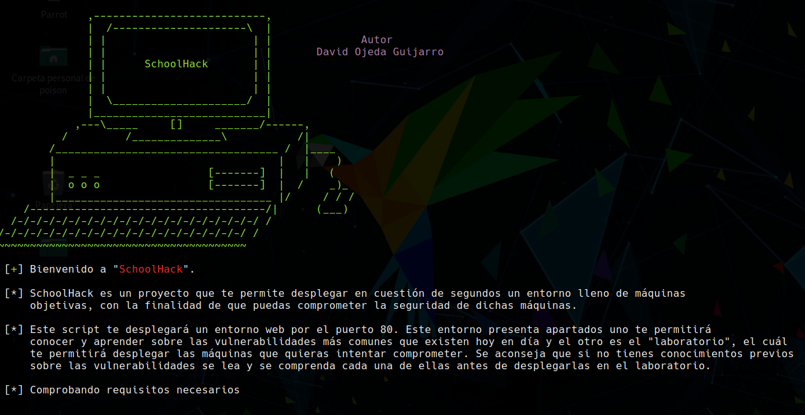
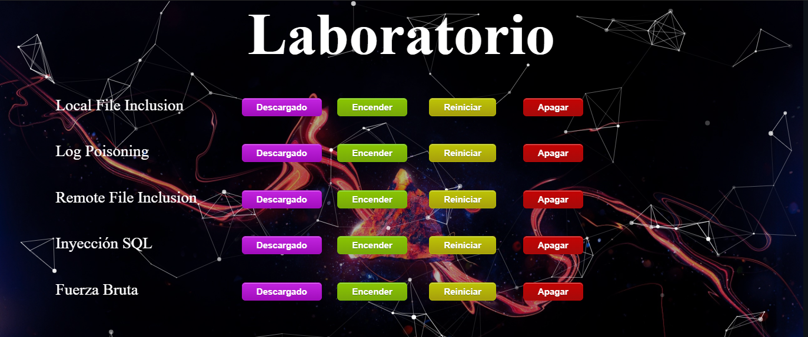

# SchoolHack
Este script te permite desplegar en cuestión de segundos un entorno lleno de máquinas objetivas, con la finalidad de que el usuario pueda comprometer la seguridad de dichas máquinas. El entorno web cuenta con una sección de aprendizaje, donde los usuarios pueden profundizar sobre la vulnerabilidad que elijan y aprendan las distintas formas de explotarla.

<p align="center">

</p>


## Comenzando 🚀

Descargue y ejecute el script en bash con el siguiente comando:
```
bash SchoolHack.sh
```
<p align="center">

</p>


## Recomendaciones ⚠️

Este entorno ha sido diseñado para su uso y disfrute en el navegador Google-Chrome, aunque cabe destacar que se ha adaptado para su visualización en firefox.

Para evitar problemas a la hora de descargar las máquinas vulnerables se recomienda usar Google-Chrome.


## Testeado ⚙️

Este script se ha testeado en los siguientes sistemas operativos:

• Kali Linux

• Parrot Security

• Linux Mint

• Ubuntu


## Instrucciones 📖

La primera vez que ejecutes el script te levantará el entorno web y se ocupará de instalar todas las utilidades y dependencias necesarias para el correcto funcionamiento de SchoolHack. Al acabar su ejecución, informará al usuario de que es necesario reiniciar el equipo.

La segunda vez que ejecutes el script, este comprobará que todo este correctamente montado, si es así, levantará el servidor web en caso de que no se encuentre levantado y te mostrará la dirección para acceder al entorno web.

Una vez accedas a http://scholhack.local te encontrarás con una interfaz muy agradable e intuitava.

Sección de aprendizaje:

<p align="center">

</p>

Laboratorio:

<p align="center">

</p>

## Autor ✒️
* **David Ojeda Guijarro**

#### Para la creación de las máquinas se ha utilizado docker 🛠️
